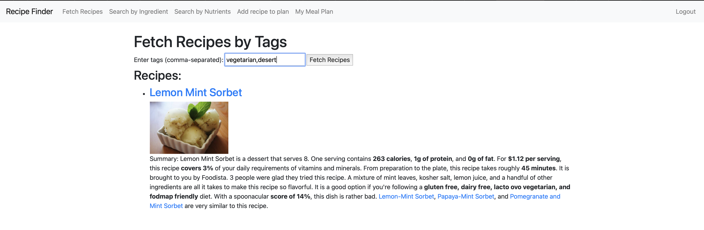

# Recipe_Finder_and_Meal_Planner
Functionality of the Recipe Finder and Meal Planner application
This web app allows users to find recipes based on the ingredients they have and plan their meals for the week. Here are the main features of the app:

1. Registration and authorization of users

Registration: Users can register by filling out a form with personal data (name, surname, e-mail).
Login: Users can login using their login and password.
Logout: Authorized users can log out of their account.
2. Search for recipes

By Tags: Users can find random recipes by selecting tags (eg vegetarian, desserts and so on).

By Ingredients: Users can search for recipes by specifying the ingredients they have.
By Nutrition: Users can find recipes based on parameters such as minimum protein, maximum calories, minimum carbohydrates, and maximum fat.
3. View recipe details

Users can view detailed information about a recipe, including ingredients, cooking instructions, cooking time, and number of servings.
4. Meal planning

Adding a recipe to a plan: Authorized users can add recipes to their meal plan by selecting a date, slot (breakfast, lunch, dinner) and position in the plan.
View Weekly Plan: Users can view their meal plan for the week, view recipes planned for specific days.
5. Deleting a recipe from the plan

Users can remove recipes from the meal plan if needed.
Technical details
Technology stack:

Django: Used to create a web interface and work with a database.
Requests: Used to interact with Spoonacular's external API to retrieve recipes.
API: The app is integrated with the Spoonacular API to retrieve recipe information. Users must obtain an API key and a host to access the API.

Configuration files:

.env: Stores sensitive data such as API key and host.
How to use
Settings:

Sign up for RapidAPI and get an API key for Spoonacular.
Add the API key and host to the .env file.
Launching:

Use Django to run a local server.
Go to the web interface and use the functionality for registration, authorization, recipe search and meal planning.
This app provides a convenient tool for finding recipes and planning meals, which can be useful for anyone who wants to organize their meals more efficiently.

Setup

Clone the repository:

git clone https://github.com/VasiaBirchak/Recipe_Finder_and_Meal_Planner.git
cd recipe_planner
Create and activate a virtual environment:

python3 -m venv venv
source venv/bin/activate
Install the required packages:

pip install -r requirements.txt
Apply migrations:

python manage.py migrate
Create a superuser:

python manage.py createsuperuser
Run the development server:

python manage.py runserver

Development and Testing

Install the development dependencies:

pip install -r requirements.txt
Run the tests:

pytest
Tests are located in the recipes/tests/ directory.