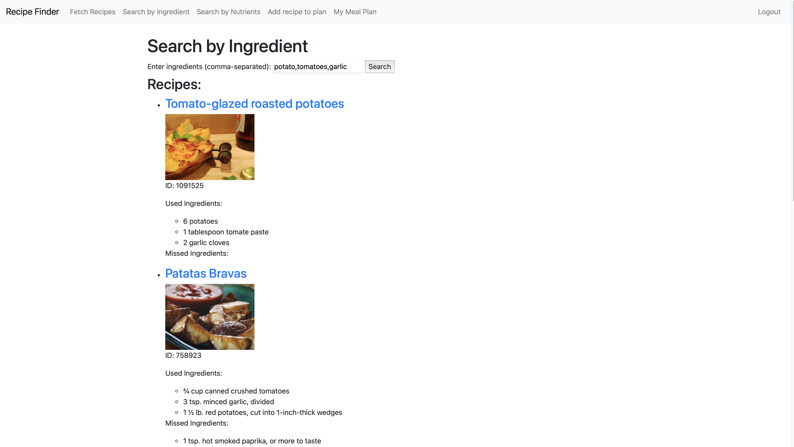
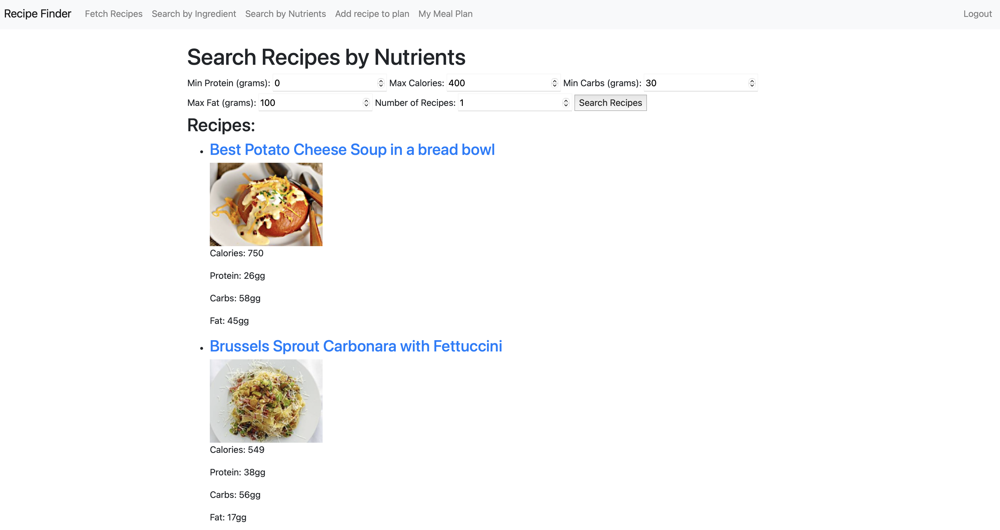
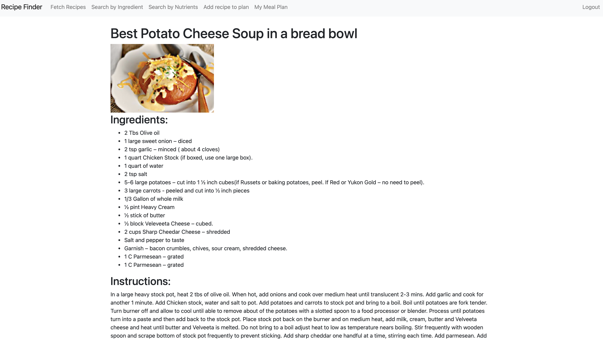
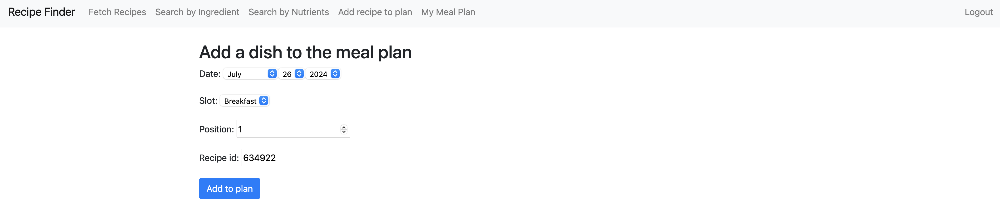
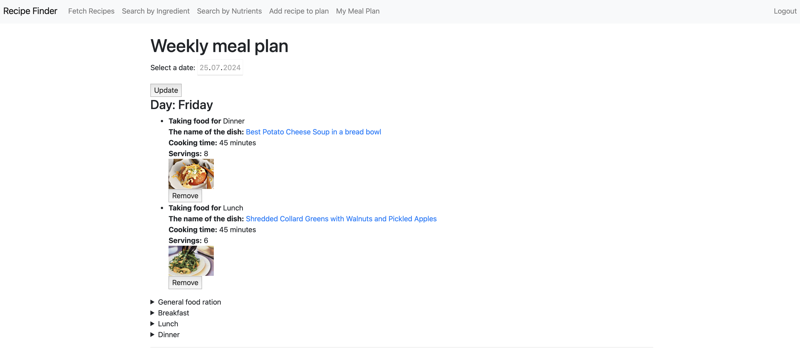

# Recipe Finder and Meal Planner

## Functionality of the Recipe Finder and Meal Planner Application

This web app allows users to find recipes based on the ingredients they have and plan their meals for the week. Here are the main features of the app:

### 1. Registration and Authorization of Users

- **Registration:** Users can register by filling out a form with personal data (name, surname, e-mail).
- **Login:** Users can login using their login and password.
- **Logout:** Authorized users can log out of their account.

### 2. Search for Recipes

- **By Tags:** Users can find random recipes by selecting tags (e.g., vegetarian, desserts, etc.).

  

- **By Ingredients:** Users can search for recipes by specifying the ingredients they have.

  

- **By Nutrition:** Users can find recipes based on parameters such as minimum protein, maximum calories, minimum carbohydrates, and maximum fat.

  

### 3. View Recipe Details

Users can view detailed information about a recipe, including ingredients, cooking instructions, cooking time, and number of servings.

  

### 4. Meal Planning

- **Adding a Recipe to a Plan:** Authorized users can add recipes (by recipe id) to their meal plan by selecting a date, slot (breakfast, lunch, dinner), and position in the plan.

  

  If a dish is successfully added to the user's meal plan, a message is displayed.

  

- **View Weekly Plan:** Users can view their meal plan for the week and view recipes planned for specific days.

  

### 5. Deleting a Recipe from the Plan

Users can remove recipes from the meal plan if needed by pressing the "Remove" button on the user's weekly meal plan page.
If the meal is successfully removed from the user's meal plan, a message is displayed.

  

## Technical Details

### Technology Stack:

- **Django:** Used to create a web interface and work with a database.
- **Requests:** Used to interact with Spoonacular's external API to retrieve recipes.
- **API:** The app is integrated with the Spoonacular API to retrieve recipe information. Users must obtain an API key and a host to access the API.

### Setup

#### Clone the Repository:

```bash
git clone https://github.com/VasiaBirchak/Recipe_Finder_and_Meal_Planner.git
cd recipe_planner
```
### Create and Activate a Virtual Environment:
```bash
python3 -m venv venv
source venv/bin/activate
```
Install the Required Packages:

```bash
pip install -r requirements.txt
```
Apply Migrations:

```bash
python manage.py migrate
```
Create a Superuser:

```bash
python manage.py createsuperuser
```
Configuration Files:
.env: Stores sensitive data such as API key and host.

Example .env File:

```bash
RAPIDAPI_KEY=your_api_key
RAPIDAPI_HOST=your_api_host
```
Run the Development Server:
```bash
python manage.py runserver
```
How to Use
Sign up for RapidAPI and get an API key for Spoonacular.
Create an .env file and place it in the root of your project so it's easy to find and use.
Add the API key and host to the .env file.


Launching:
Use Django to run a local server.
Go to the web interface and use the functionality for registration, authorization, recipe search, and meal planning.
This app provides a convenient tool for finding recipes and planning meals, which can be useful for anyone who wants to organize their meals more efficiently.

Development and Testing

Install the Development Dependencies:

```bash
pip install -r requirements.txt
```
Run the Tests:

```bash
pytest
```
Tests are located in the recipes/tests/ directory.